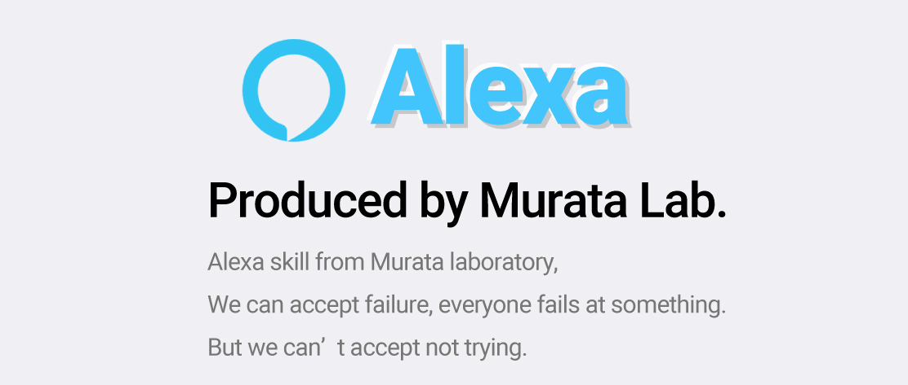

# オープンキャンパス用のチャットボット



# 環境の起動の仕方

dockerで開発したい人は以下のコマンドで環境ができるはず

仮想環境の中にソースがダウンロードされるはず

```
cd alexa_env
docker build -t env .
```

または

```
docker pull mori0097/alexa
```
## テストするには

随時更新予定


- ngrokのインストール

```
brew cask intall ngrok
```

- alexa_bot.py の実行

仮想環境内で実行

```
cd Zemi_alexa
python3 alexa_bot.py
```

僕はこんな感じでローカルのファイルをマウントしてます

ポートの8080:80が開くはずです

```
$ docker run --name alexa -it -p 8080:80 -v ~/Documents/alexa:/code mori0097/alexa
```

# 注意事項

- opensslのばーじょん

仮想環境の中ではどうかわからないけど`openssl version`と打って`LibreSSL`って出るのはだめみたい

- cannot import Updateが出た時

python-telegram-botを入れ直しましょう

```
pip uninstall python-telegram-bot

pip install python-telegram-bot
```
